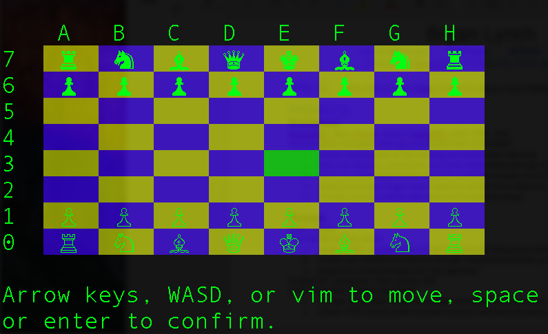

# rubychess

<h3>Command-line Chess Game Built With Ruby</h3>

<h1>Steps on how to play</h1>

<ul>
  <li>Clone this repository to your machine.</li>
  <li>Navigate to the repos directory and run ruby game.rb from the terminal</li>
  <li>Use Arrow keys, WASD or VIM controls to navigate, and space or enter to select</li>
  <li>Moves consist of two steps: (1) select the piece you want to move (2) select where to move the piece.</li>
</ul>

<h3>Todo List</h3>
<ul>
   <li>Improve AI speed through heuristics and memory management</li>
   <li>Add networking</li>
   <li>Keep track of moves via chess notation in the sidebar</li>
</ul>
